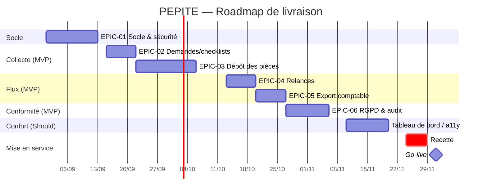

# PEPITE — Chiffrage & planning

> Produit par `chiffrage` depuis `backlog/backlog.md` (+ compréhension). **Toutes les valeurs
> sont indicatives** et reposent sur les hypothèses ci-dessous, à valider.

## 1. Hypothèses (à valider)
| Paramètre | Valeur (réaliste) | Statut |
|---|---|---|
| Conversion points → charge | **0,75 j-h / point** | ⚠️ hypothèse |
| Taille d'équipe | 2 développeurs | ⚠️ hypothèse |
| Vélocité | ~20 points / sprint (2 semaines) | ⚠️ hypothèse |
| TJM | **500 € HT** (placeholder — non fourni au CDC) | ⚠️ hypothèse |
| Périmètre chiffré | Must + Should = **115 pts** (hors OCR *Could* et signature *Won't*) | — |

## 2. Charge de développement par epic
| Epic | Points | Charge dev (× 0,75 j) |
|---|---|---|
| EPIC-01 Socle technique & sécurité | 26 | 19,5 j |
| EPIC-02 Gestion des demandes | 11 | 8,25 j |
| EPIC-03 Dépôt & gestion des pièces | 24 | 18,0 j |
| EPIC-04 Relances & notifications | 13 | 9,75 j |
| EPIC-05 Pilotage & export | 16 | 12,0 j |
| EPIC-06 Conformité, RGPD & réversibilité | 25 | 18,75 j |
| **Total dev (Must+Should)** | **115** | **86,25 j** |
| *dont MVP (Must, 84 pts)* | 84 | *63,0 j* |
| OCR (Could, optionnel) | +8 | +6,0 j |

## 3. Charges annexes (build-up sur la charge dev)
| Poste | % | Charge |
|---|---|---|
| Conception / affinage | 10 % | 8,6 j |
| Recette / QA | 15 % | 12,9 j |
| Gestion de projet | 12 % | 10,4 j |
| Déploiement / CI | 5 % | 4,3 j |
| Contingence | 15 % | 12,9 j |
| **Sous-total annexes** | **57 %** | **49,1 j** |
| **CHARGE TOTALE (Must+Should)** | | **≈ 135 j-h** |
| *dont MVP* | | *≈ 99 j-h* |

## 4. Coût (TJM 500 € — hypothèse)
| Poste | Nature | Estimation |
|---|---|---|
| Développement complet (135 j) | Ponctuel | **≈ 67 700 €** |
| *dont MVP (99 j)* | Ponctuel | *≈ 49 500 €* |
| Hébergement (Blob + part VM Azure) | Récurrent /an | ⚠️ **à chiffrer** (lacune §8.3) |
| Maintenance (15 %/an du build) | Récurrent /an | ≈ 10 200 € /an |
| Support | Récurrent /an | ⚠️ à chiffrer |
| **TCO 3 ans (build + 3× maintenance, hors héberg.)** | | **≈ 98 300 €** |

> Rapprochement CDC : l'enveloppe « dev prestataire 180 k€ » du CDC suppose un TJM/scope
> supérieurs. À TJM 700 € et ratio 1 j/pt, le build complet ≈ 133 k€ (cf. sensibilité).

## 5. Planning / sprints (cible : démarrage 01/09/2026 → go-live 01/12/2026)
| Sprint | Dates | Contenu |
|---|---|---|
| Sprint 0 | 01→12/09 | EPIC-01 socle (scaffold, BDD+RLS, auth) |
| Sprint 1 | 15→26/09 | EPIC-02 demandes/checklists + début EPIC-03 |
| Sprint 2 | 29/09→10/10 | EPIC-03 dépôt/intégrité/validation |
| Sprint 3 | 13→24/10 | EPIC-04 relances + EPIC-05 export comptable |
| Sprint 4 | 27/10→07/11 | EPIC-06 RGPD/audit/conservation/droits |
| Sprint 5 | 10→21/11 | Should (tableau de bord, prévisualisation, accessibilité, durcissement) |
| Recette | 24→28/11 | PV de recette |
| **Go-live** | **01/12** | Mise en production |

> Le MVP (Must) tient en ~Sprints 0→4 ; les Should en Sprint 5. Planning **tendu mais tenable**
> à 2 devs si le scope Must est gelé (cf. risque planning du dossier de compréhension).

## 6. Roadmap — GANTT (Mermaid)

## 7. Sensibilité
| Scénario | Ratio | Annexes | TJM | Charge | Coût build |
|---|---|---|---|---|---|
| Optimiste | 0,5 j/pt | 40 % | 450 € | ~80 j | **≈ 36 000 €** |
| **Réaliste** | 0,75 j/pt | 57 % | 500 € | ~135 j | **≈ 67 700 €** |
| Pessimiste | 1,0 j/pt | 65 % | 700 € | ~190 j | **≈ 133 000 €** |

## 8. Risques de chiffrage & points à valider
- **TJM réel** (interne vs prestataire) — facteur de coût n°1.
- **Vélocité réelle** de l'équipe (impacte délais et tenue du 01/12).
- **Coûts récurrents** hébergement/stockage Blob (volumétrie 500k pièces/an × 10 ans) — lacune §8.3.
- Périmètre Must **gelé** ? Tout ajout décale le go-live.

---
**Charge totale : ~80–190 j-h (réaliste ~135). TCO 3 ans : ~70–170 k€ (hors hébergement à chiffrer).**
3 hypothèses les plus sensibles : **TJM**, **vélocité**, **coûts d'hébergement**.
