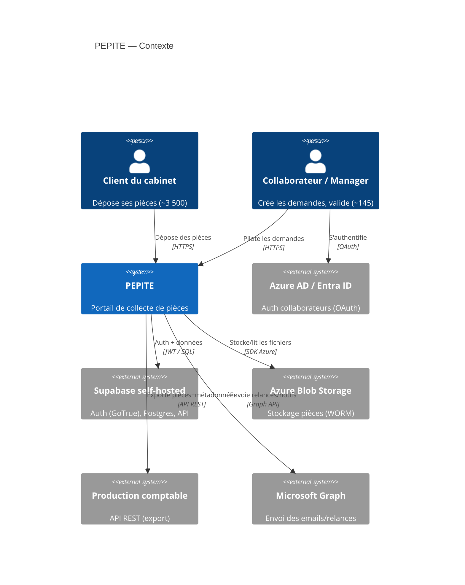

# PEPITE — Architecture

## 1. Contexte (C4 niveau 1)



## 2. Conteneurs (C4 niveau 2)

```mermaid
flowchart TB
  subgraph public["Public (443)"]
    nginx["nginx reverse-proxy\n(seul exposé)"]
  end
  subgraph stack["/opt/stacks/pepite (127.0.0.1)"]
    web["pepite-web\nVue 3 + Vite (static, nginx)\n:8107"]
    api["pepite-api\nNestJS + Prisma\n:8108"]
    worker["pepite-worker\nJobs: relances, export, purge\n(BullMQ)"]
    redis["redis\n(file de jobs)"]
  end
  subgraph shared["Services partagés Azure (existants)"]
    supa["Supabase\nGoTrue + Postgres + Kong :8400"]
    blob["Azure Blob (WORM)"]
    graph["Microsoft Graph"]
    compta["API production comptable"]
  end

  nginx -->|"pepite.<ip>.nip.io/"| web
  nginx -->|"/api/"| api
  web -->|"REST + JWT"| api
  api --> supa
  api --> blob
  worker --> redis
  api --> redis
  worker --> graph
  worker --> compta
  api -->|"vérifie JWT"| supa
```

## 3. Stack détaillée
- **Front (`pepite-web`)** : Vue 3 (Composition API) + TypeScript, Vite, Pinia (état), Vue
  Router, `@supabase/supabase-js` (login + récupération du JWT), client HTTP vers `/api`.
  Build statique servi par un petit nginx conteneurisé sur `:8107`. Accessibilité RGAA AA,
  responsive (poste fixe + mobilité), i18n FR.
- **API (`pepite-api`)** : NestJS + TypeScript, Prisma (multiSchema `pepite` + `core`).
  Vérifie le JWT Supabase (JWKS), applique les guards d'autorisation, expose l'API REST,
  signe les URLs Blob (upload/download), écrit la piste d'audit, publie les jobs.
- **Worker (`pepite-worker`)** : BullMQ (Redis) pour les tâches asynchrones : relances
  programmées, export vers la production comptable, purge RGPD, (option) OCR.
- **Données** : Supabase Postgres (schémas `pepite` + `core`), Azure Blob (fichiers).

## 4. Flux clés
1. **Dépôt d'une pièce** : le client demande une URL d'upload signée à l'API → upload direct
   vers Azure Blob → l'API enregistre métadonnées + hash SHA-256 dans `pepite.piece` → met à
   jour le statut de la checklist → journalise.
2. **Relance automatique** : le worker scrute les demandes incomplètes échues → envoie via
   Graph → enregistre la relance.
3. **Export comptable** : à la validation de complétude, le worker pousse pièces+métadonnées
   vers l'API de production comptable, avec rejeu en cas d'échec.

## 5. Élasticité (pics ×5)
Services `web`/`api`/`worker` **stateless** → mise à l'échelle horizontale (réplicas) ;
l'upload direct client→Blob (URL signée) sort les gros transferts du chemin API ; les tâches
lourdes sont asynchrones (worker) pour absorber les pics de clôture sans dégrader l'interactif.
Cible : <2 s p95 (<5 s au pic ×5).
