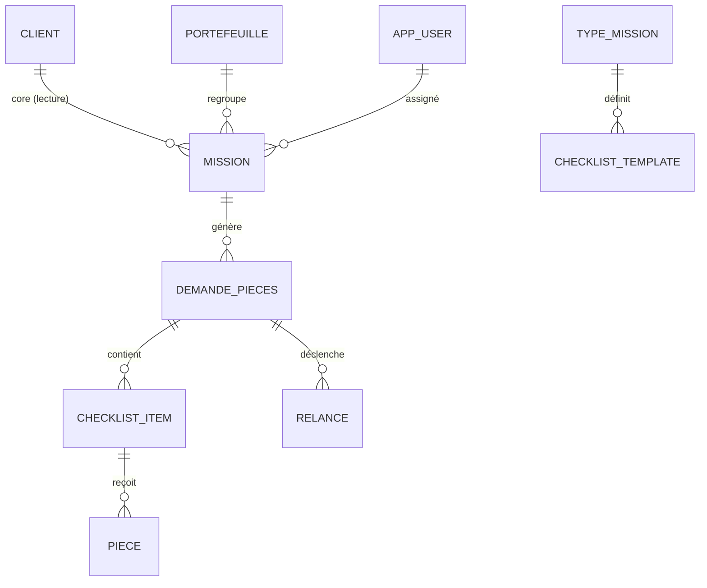

# PEPITE — Modèle de données

## Stratégie de schéma (conforme à DATABASE.md d'Azure-Infra)
- **Greffe** d'un schéma `pepite` dans l'instance Supabase de l'environnement (isolation
  physique par env : dev local / staging / prod).
- Réutilisation du schéma **`core`** partagé (clients, contacts) — `pepite` y accède en
  **lecture seule**, jamais en écriture (le `core` est la seule passerelle inter-apps).
- **Rôle PG dédié** `pepite_app` : `USAGE` + droits sur `pepite`, `SELECT` sur `core`. Jamais superuser.
- **RLS activée** sur toutes les tables `pepite` pour le cloisonnement multi-tenant.

## Diagramme entités



## DDL (extrait, PostgreSQL)

```sql
create schema if not exists pepite;

-- Profil applicatif lié à auth.users (Supabase). 'client' ou 'staff'.
create table pepite.app_user (
  id            uuid primary key references auth.users(id) on delete cascade,
  type          text not null check (type in ('staff','client')),
  role          text not null check (role in ('admin','manager','collaborateur','client')),
  client_id     uuid,            -- pour les clients : -> core.clients(id)
  created_at    timestamptz not null default now()
);

create table pepite.portefeuille (
  id            uuid primary key default gen_random_uuid(),
  libelle       text not null,
  manager_id    uuid references pepite.app_user(id)
);

create table pepite.mission (
  id            uuid primary key default gen_random_uuid(),
  client_id     uuid not null,   -- -> core.clients(id) (lecture seule via core)
  portefeuille_id uuid references pepite.portefeuille(id),
  type_mission  text not null,
  exercice      text not null,   -- ex. '2026'
  statut        text not null default 'ouverte',
  created_at    timestamptz not null default now()
);

create table pepite.demande_pieces (
  id            uuid primary key default gen_random_uuid(),
  mission_id    uuid not null references pepite.mission(id) on delete cascade,
  statut        text not null default 'en_cours', -- en_cours|complete|cloturee
  date_echeance date,
  created_by    uuid references pepite.app_user(id),
  created_at    timestamptz not null default now()
);

create table pepite.checklist_item (
  id            uuid primary key default gen_random_uuid(),
  demande_id    uuid not null references pepite.demande_pieces(id) on delete cascade,
  type_piece    text not null,
  libelle       text not null,
  obligatoire   boolean not null default true,
  statut        text not null default 'attendue' -- attendue|recue|validee|refusee
);

create table pepite.piece (
  id            uuid primary key default gen_random_uuid(),
  checklist_item_id uuid not null references pepite.checklist_item(id) on delete cascade,
  blob_uri      text not null,            -- URI Azure Blob (conteneur WORM)
  nom_fichier   text not null,
  mime          text not null,
  taille_octets bigint not null,
  hash_sha256   text not null,            -- intégrité / valeur probante
  deposee_par   uuid references pepite.app_user(id),
  deposee_le    timestamptz not null default now(),
  statut        text not null default 'recue'
);

create table pepite.relance (
  id            uuid primary key default gen_random_uuid(),
  demande_id    uuid not null references pepite.demande_pieces(id) on delete cascade,
  type          text not null,            -- auto|manuelle
  canal         text not null default 'email',
  envoyee_le    timestamptz not null default now(),
  statut        text not null default 'envoyee'
);

-- Piste d'audit (append-only) : conformité métier (§7 du CDC)
create table pepite.audit_log (
  id            bigserial primary key,
  actor_id      uuid,
  action        text not null,
  entite        text not null,
  entite_id     text,
  details       jsonb,
  at            timestamptz not null default now()
);
```

## RLS — cloisonnement (defense-in-depth)

```sql
alter table pepite.mission enable row level security;
alter table pepite.piece   enable row level security;
-- ... (toutes les tables pepite)

-- Le client ne voit que ses propres pièces ; le staff selon son périmètre.
create policy mission_client_read on pepite.mission for select
  using (
    exists (select 1 from pepite.app_user u
            where u.id = auth.uid() and u.type='client' and u.client_id = mission.client_id)
    or exists (select 1 from pepite.app_user u
            where u.id = auth.uid() and u.role in ('admin','manager','collaborateur'))
  );
```

> **Note Prisma + RLS** : Prisma se connecte via le rôle `pepite_app`. L'autorisation fine
> est appliquée à deux niveaux : (1) **guards NestJS** (source de vérité applicative), et (2)
> **RLS** en filet de sécurité, en propageant l'identité via `SET LOCAL request.jwt.claims`
> par requête (intercepteur Prisma) ou via un client PostgREST authentifié pour les lectures
> simples. Voir [04-securite-rgpd.md](04-securite-rgpd.md).

## Conservation & purge (RGPD)
- Pièces : 10 ans (valeur probante) — fichiers en Blob WORM, métadonnées conservées.
- Données personnelles hors obligation : purge **3 ans après fin de mission** (job worker).
- `audit_log` : conservation alignée sur l'obligation de piste d'audit ; append-only.

## Réversibilité
Export **CSV/JSON** de tous les schémas `pepite` (commande dédiée + endpoint admin) ;
fichiers ré-exportables depuis Blob. Migrations versionnées dans le repo applicatif
(`prisma/migrations` + SQL `pepite`).
